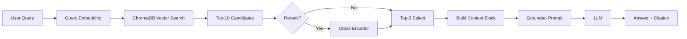

# Architecture — RAG Pipeline (Day 08 Lab)

> Template: Điền vào các mục này khi hoàn thành từng sprint.
> Deliverable của Documentation Owner.

## 1. Tổng quan kiến trúc

```
[Raw Docs]
    ↓
[index.py: Preprocess → Chunk → Embed → Store]
    ↓
[ChromaDB Vector Store]
    ↓
[rag_answer.py: Query → Retrieve → Rerank → Generate]
    ↓
[Grounded Answer + Citation]
```

**Môn:** AI trong hành động.
**Hệ thống RAG Helpdesk** giúp tự động tìm kiếm và trả lời các thắc mắc về chính sách, SLA cấp quyền trong môi trường kỹ thuật của công ty (IT & CS). Hệ thống chống sinh ra thông tin giả (Hallucination) thông qua quy trình đánh giá khắt khe.

---

## 2. Indexing Pipeline (Sprint 1)

### Tài liệu được index
| File | Nguồn | Department | Số chunk |
|------|-------|-----------|---------|
| `policy_refund_v4.txt` | policy/refund-v4.pdf | CS | ~ |
| `sla_p1_2026.txt` | support/sla-p1-2026.pdf | IT | ~ |
| `access_control_sop.txt` | it/access-control-sop.md | IT Security | ~ |
| `it_helpdesk_faq.txt` | support/helpdesk-faq.md | IT | ~ |
| `hr_leave_policy.txt` | hr/leave-policy-2026.pdf | HR | ~ |

### Quyết định chunking
| Tham số | Giá trị | Lý do |
|---------|---------|-------|
| Chunk size | 400 tokens | Optimal spot cho tài liệu chính sách |
| Overlap | 80 tokens | Để không đứt đoạn câu |
| Chunking strategy | Paragraph-based | Sử dụng `\n\n` để phân chia đoạn tự nhiên |
| Metadata fields | source, section, effective_date, department, access | Phục vụ filter, freshness, citation |

### Embedding model
- **Model**: Sentence Transformers API (`paraphrase-multilingual-MiniLM-L12-v2`)
- **Vector store**: ChromaDB (PersistentClient)
- **Similarity metric**: Cosine

---

## 3. Retrieval Pipeline (Sprint 2 + 3)

### Baseline (Sprint 2)
| Tham số | Giá trị |
|---------|---------|
| Strategy | Dense (embedding similarity) |
| Top-k search | 10 |
| Top-k select | 3 |
| Rerank | Không |

### Variant (Sprint 3)
| Tham số | Giá trị | Thay đổi so với baseline |
|---------|---------|------------------------|
| Strategy | Hybrid (Dense + Sparse) | Dense search + BM25 keyword matching |
| Top-k search | 10 | Tăng lên |
| Top-k select | 3 | Chọn top 3 trả lời bằng RRF |
| Rerank | Không | Không dùng Cross Encoder do token limit/ tốc độ |
| Query transform | Không | Giữ nguyên query cấu trúc |

**Lý do chọn variant này:**
> Quyết định lựa chọn phương pháp **Hybrid Search** bằng cách mix điểm Similarity RRF vì bộ dữ liệu chứa nhiều tên mã, tag kỹ thuật (e.g. ERR-403) và mã SLA. Dense search thông thường rất dễ bỏ sót các mã chính xác này.

---

## 4. Generation (Sprint 2)

### Grounded Prompt Template
```
Answer only from the retrieved context below.
If the context is insufficient, say you do not know.
Cite the source field when possible.
Keep your answer short, clear, and factual.

Question: {query}

Context:
[1] {source} | {section} | score={score}
{chunk_text}

[2] ...

Answer:
```

### LLM Configuration
| Tham số | Giá trị |
|---------|---------|
| Model | OpenAI `gpt-4o-mini` |
| Temperature | 0 (để output ổn định cho eval) |
| Max tokens | 512 |

---

## 5. Failure Mode Checklist

> Dùng khi debug — kiểm tra lần lượt: index → retrieval → generation

| Failure Mode | Triệu chứng | Cách kiểm tra |
|-------------|-------------|---------------|
| Index lỗi | Retrieve về docs cũ / sai version | `inspect_metadata_coverage()` trong index.py |
| Chunking tệ | Chunk cắt giữa điều khoản | `list_chunks()` và đọc text preview |
| Retrieval lỗi | Không tìm được expected source | `score_context_recall()` trong eval.py |
| Generation lỗi | Answer không grounded / bịa | `score_faithfulness()` trong eval.py |
| Token overload | Context quá dài → lost in the middle | Kiểm tra độ dài context_block |

---

## 6. Diagram (tùy chọn)

> TODO: Vẽ sơ đồ pipeline nếu có thời gian. Có thể dùng Mermaid hoặc drawio.


