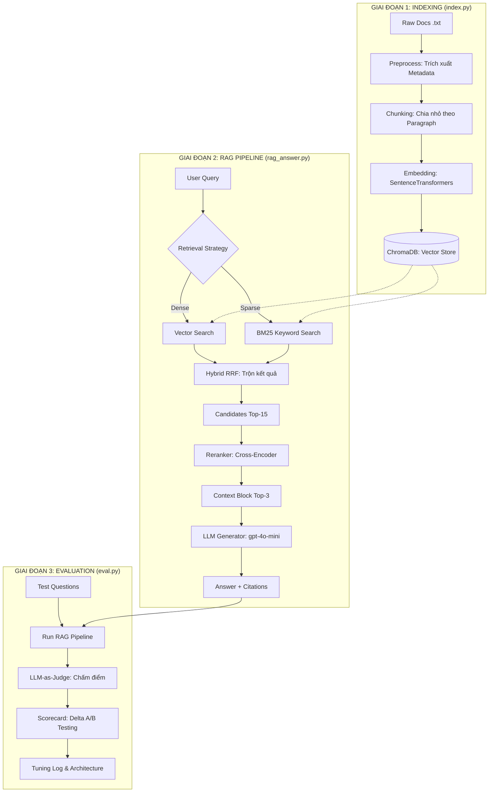

# Quy trình hoạt động (Workflow) của hệ thống RAG

Dưới đây là sơ đồ chi tiết luồng xử lý dữ liệu và truy vấn trong hệ thống RAG mà chúng ta vừa xây dựng. Quy trình được chia làm 3 giai đoạn chính: **Indexing** (Nạp dữ liệu), **RAG Pipeline** (Tra cứu & Trả lời), và **Evaluation** (Đánh giá).

## 1. Sơ đồ luồng xử lý (Mermaid Diagram)

---

## 2. Giải thích chi tiết các thành phần

### Phase 1: Ingestion & Indexing (`index.py`)
Mục tiêu là biến văn bản thô thành một cơ sở dữ liệu có thể tìm kiếm được.
1.  **Metadata Extraction**: Tự động nhận diện `Source`, `Department`, `Effective Date` từ 5 dòng đầu của file.
2.  **Paragraph Chunking**: Thay vì cắt theo số ký tự (dễ làm đứt câu), hệ thống cắt theo đoạn văn (`\n\n`) để giữ nguyên ngữ cảnh.
3.  **Local Embedding**: Sử dụng mô hình `paraphrase-multilingual-MiniLM-L12-v2` (chạy trên máy của bạn) để chuyển văn bản thành vector số.

### Phase 2: Tra cứu & Sinh lời giải (`rag_answer.py`)
Mục tiêu là tìm ra thông tin đúng nhất để trả lời khách hàng.
1.  **Hybrid Retrieval**: Kết hợp tìm kiếm theo **ý nghĩa** (Dense) và tìm kiếm theo **từ khóa chính xác** (Sparse/BM25). Điều này cực kỳ quan trọng để bắt được các mã lỗi như `ERR-403`.
2.  **Reranking**: Sử dụng một mô hình AI thứ hai (Cross-Encoder) để soi kỹ lại 15 đoạn văn bản tiềm năng nhất, chọn ra đúng 3 đoạn chứa câu trả lời "đắt" nhất.
3.  **Grounded Generation**: Ép LLM chỉ được phép trả lời dựa trên 3 đoạn văn đó. Nếu không có thông tin, LLM phải trả lời "Tôi không biết" (Abstain) để tránh bịa đặt.

### Phase 3: Đánh giá & So sánh (`eval.py`)
Mục tiêu là chứng minh hệ thống hoạt động tốt.
1.  **LLM-as-Judge**: Sử dụng `gpt-4o-mini` để đóng vai giám khảo, chấm điểm câu trả lời dựa trên:
    *   **Faithfulness**: Có trung thành với tài liệu không?
    *   **Relevance**: Có trả lời đúng trọng tâm không?
    *   **Recall**: Có tìm đúng file tài liệu cần thiết không?
2.  **A/B Comparison**: So sánh giữa cấu hình tìm kiếm đơn giản (Baseline) và cấu hình Hybrid+Rerank (Variant) để thấy sự vượt trội về điểm số.

---

> [!TIP]
> **Thứ tự thực hiện khi chạy bài Lab:**
> 1. Chạy `index.py` để "học" tài liệu.
> 2. Chạy `eval.py` để "kiểm tra" và sinh báo cáo so sánh.
> 3. Chạy `run_grading.py` khi nhận được đề thi thật từ thầy giáo.
