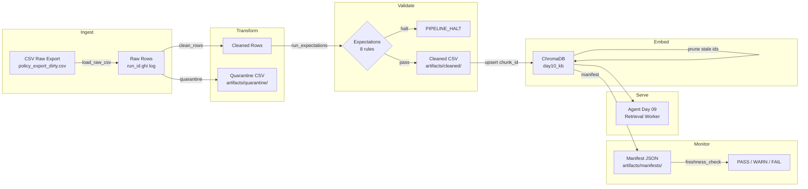

# Kiến trúc pipeline — Lab Day 10

**Nhóm:** Đào Quang Thắng  
**Cập nhật:** 2026-04-15

---

## 1. Sơ đồ luồng

> **Điểm đo freshness:** tại bước `publish` (sau embed upsert), đọc `latest_exported_at` từ manifest.  
> **run_id:** ghi trong log + manifest JSON, dùng để trace mọi artifact về cùng 1 lần chạy.  
> **Quarantine:** lưu riêng `artifacts/quarantine/quarantine_<run_id>.csv`, không embed.

---

## 2. Ranh giới trách nhiệm

| Thành phần | Input | Output | Owner nhóm |
|------------|-------|--------|------------|
| Ingest | `data/raw/policy_export_dirty.csv` | Raw rows (list dict) + log `raw_records` | **Đào Quang Thắng** |
| Transform | Raw rows | Cleaned rows + Quarantine CSV | **Phạm Hoàng Kim Liên** |
| Quality | Cleaned rows | Expectation results (OK/FAIL) + halt decision | **Phạm Hoàng Kim Liên** |
| Embed | Cleaned CSV | ChromaDB collection `day10_kb` (upsert + prune) | **Phạm Hải Đăng** |
| Monitor | Manifest JSON | Freshness status (PASS/WARN/FAIL) | **Đào Quang Thắng** |

---

## 3. Idempotency & rerun

**Strategy:** Upsert theo `chunk_id` ổn định (hash của `doc_id + chunk_text + seq`).

- Mỗi lần `run`, pipeline tính `chunk_id` cho tất cả cleaned rows.
- **Upsert:** ChromaDB `col.upsert(ids=ids, ...)` — nếu id đã tồn tại thì ghi đè, không duplicate.
- **Prune:** Sau upsert, pipeline so sánh id hiện có trong collection với id trong cleaned run → xóa id không còn trong cleaned (`embed_prune_removed`).
- **Kết quả:** Rerun 2 lần liên tiếp → `embed_upsert count` giữ nguyên = 6, `embed_prune_removed` = 0 (hoặc 1 nếu lần trước inject).

Kiểm chứng: chạy `py etl_pipeline.py run` 2 lần → log cho thấy `embed_upsert count=6` cả 2 lần, collection count không phình.

---

## 4. Liên hệ Day 09

Pipeline Day 10 cung cấp corpus sạch cho retrieval trong `day09/lab`:

- **Cùng domain:** 5 tài liệu trong `data/docs/` (policy_refund_v4, sla_p1_2026, it_helpdesk_faq, hr_leave_policy, access_control_sop) trùng nội dung Day 09.
- **Tách collection:** Day 10 dùng collection `day10_kb` (tách khỏi Day 09) để tránh xung đột khi thí nghiệm inject/clean.
- **Tích hợp:** Nếu cần feed lại Day 09, chỉ cần đổi `CHROMA_COLLECTION` trong `.env` hoặc copy cleaned CSV sang `day09/lab/data/docs/`.

---

## 5. Rủi ro đã biết

- **Freshness FAIL trên data mẫu:** `exported_at` trong CSV mẫu là `2026-04-10T08:00:00`, cách hiện tại > 24h → FAIL là hợp lý. Giải thích trong runbook.
- **Encoding Windows:** `print()` trên cp1252 gây crash khi có ký tự Unicode đặc biệt (→, tiếng Việt). Cần `PYTHONIOENCODING=utf-8`.
- **Chỉ 10 rows mẫu:** Bộ dữ liệu nhỏ, chưa phản ánh production scale. Distribution monitoring có ý nghĩa hạn chế.
